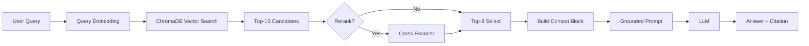

# Architecture — RAG Pipeline (Day 08 Lab)

> Template: Điền vào các mục này khi hoàn thành từng sprint.
> Deliverable của Documentation Owner.

## 1. Tổng quan kiến trúc

```
[Raw Docs]
    ↓
[index.py: Preprocess → Chunk → Embed → Store]
    ↓
[ChromaDB Vector Store]
    ↓
[rag_answer.py: Query → Retrieve → Rerank → Generate]
    ↓
[Grounded Answer + Citation]
```

Hệ thống RAG (Retrieval-Augmented Generation) được thiết kế để hỗ trợ tra cứu các chính sách và quy trình nội bộ của doanh nghiệp. Hệ thống tự động tìm kiếm thông tin từ các tài liệu PDF/Markdown và sử dụng LLM để đưa ra câu trả lời có trích dẫn nguồn, giúp giảm thiểu sai sót và tăng tốc độ xử lý yêu cầu phản hồi.

---

## 2. Indexing Pipeline (Sprint 1)

### Tài liệu được index
| File | Nguồn | Department | Số chunk |
|------|-------|-----------|---------|
| `policy_refund_v4.txt` | policy/refund-v4.pdf | CS | 6 |
| `sla_p1_2026.txt` | support/sla-p1-2026.pdf | IT | 5 |
| `access_control_sop.txt` | it/access-control-sop.md | IT Security | 6 |
| `it_helpdesk_faq.txt` | support/helpdesk-faq.md | IT | 5 |
| `hr_leave_policy.txt` | hr/leave-policy-2026.pdf | HR | 7 |

### Quyết định chunking
| Tham số | Giá trị | Lý do |
|---------|---------|-------|
| Chunk size | 400 chars | Cân bằng giữa việc giữ đủ ngữ cảnh và tối ưu chi phí token. |
| Overlap | 100 chars | Tránh mất thông tin quan trọng bị cắt ngang giữa các đoạn. |
| Chunking strategy | Paragraph-based (`\n\n`) | Giữ trọn vẹn ngữ nghĩa của các điều khoản và mục lục. |
| Metadata fields | source, section, effective_date, department, access | Phục vụ filter, freshness, citation |

### Embedding model
- **Model**: OpenAI `text-embedding-3-small` (1536 dims)
- **Vector store**: ChromaDB (PersistentClient)
- **Similarity metric**: Cosine Similarity

---

## 3. Retrieval Pipeline (Sprint 2 + 3)

### Baseline (Sprint 2)
| Tham số | Giá trị |
|---------|---------|
| Strategy | Dense (embedding similarity) |
| Top-k search | 10 |
| Top-k select | 3 |
| Rerank | Không |

### Variant (Sprint 3)
| Tham số | Giá trị | Thay đổi so với baseline |
|---------|---------|------------------------|
| Strategy | Hybrid (Dense + Sparse) | Kết hợp thế mạnh của Vector và Keyword matching |
| Top-k search | 10 | Giữ nguyên để đánh giá công bằng |
| Top-k select | 3 | Giữ nguyên để đảm bảo grounding tốt nhất |
| Rerank | Không | Sprint 3 tập trung vào cải thiện retrieval recall |
| Query transform | Không | Ưu tiên RRF fusion cho hybrid |

**Lý do chọn variant này:**
Chọn hybrid vì corpus có cả câu tự nhiên (policy) lẫn mã lỗi và tên chuyên ngành (SLA ticket P1, ERR-403). Hybrid giúp bắt trúng các exact keyword mà Dense đôi khi bỏ qua.

---

## 4. Generation (Sprint 2)

### Grounded Prompt Template
```
Answer only from the retrieved context below.
If the context is insufficient, say you do not know.
Cite the source field when possible.
Keep your answer short, clear, and factual.

Question: {query}

Context:
[1] {source} | {section} | score={score}
{chunk_text}

[2] ...

Answer:
```

### LLM Configuration
| Tham số | Giá trị |
|---------|---------|
| Model | OpenAI `5.4-mini` |
| Temperature | 0 (đảm bảo tính ổn định cho Evaluation) |
| Max tokens | 512 |

---

## 5. Failure Mode Checklist

> Dùng khi debug — kiểm tra lần lượt: index → retrieval → generation

| Failure Mode | Triệu chứng | Cách kiểm tra |
|-------------|-------------|---------------|
| Index lỗi | Retrieve về docs cũ / sai version | `inspect_metadata_coverage()` trong index.py |
| Chunking tệ | Chunk cắt giữa điều khoản | `list_chunks()` và đọc text preview |
| Retrieval lỗi | Không tìm được expected source | `score_context_recall()` trong eval.py |
| Generation lỗi | Answer không grounded / bịa | `score_faithfulness()` trong eval.py |
| Token overload | Context quá dài → lost in the middle | Kiểm tra độ dài context_block |

---

## 6. Diagram (tùy chọn)

> TODO: Vẽ sơ đồ pipeline nếu có thời gian. Có thể dùng Mermaid hoặc drawio.


